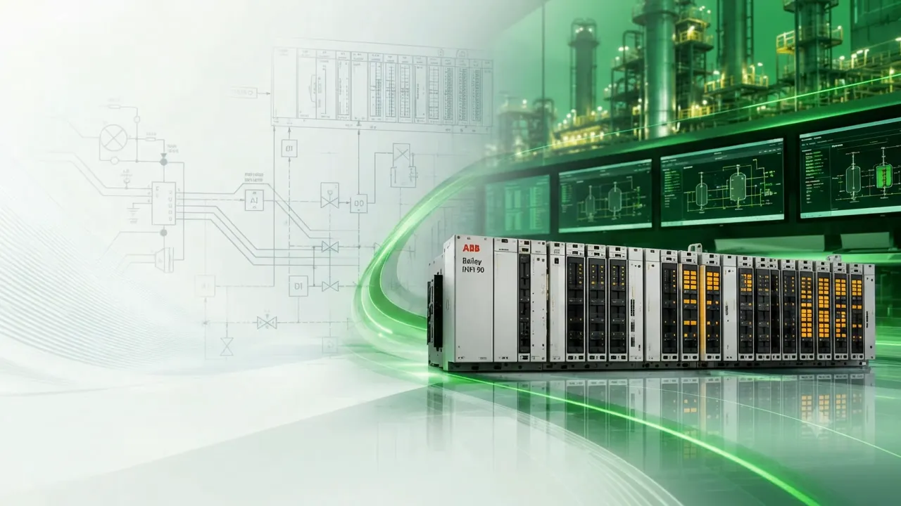
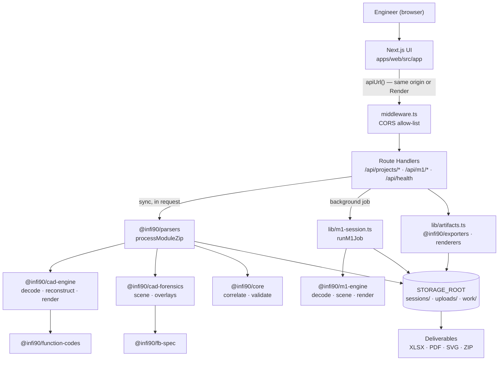
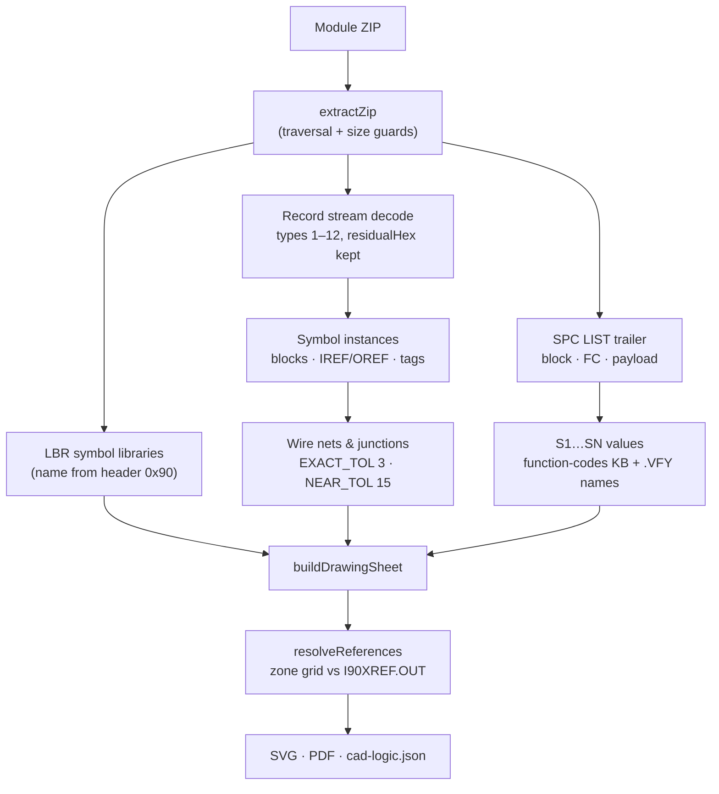
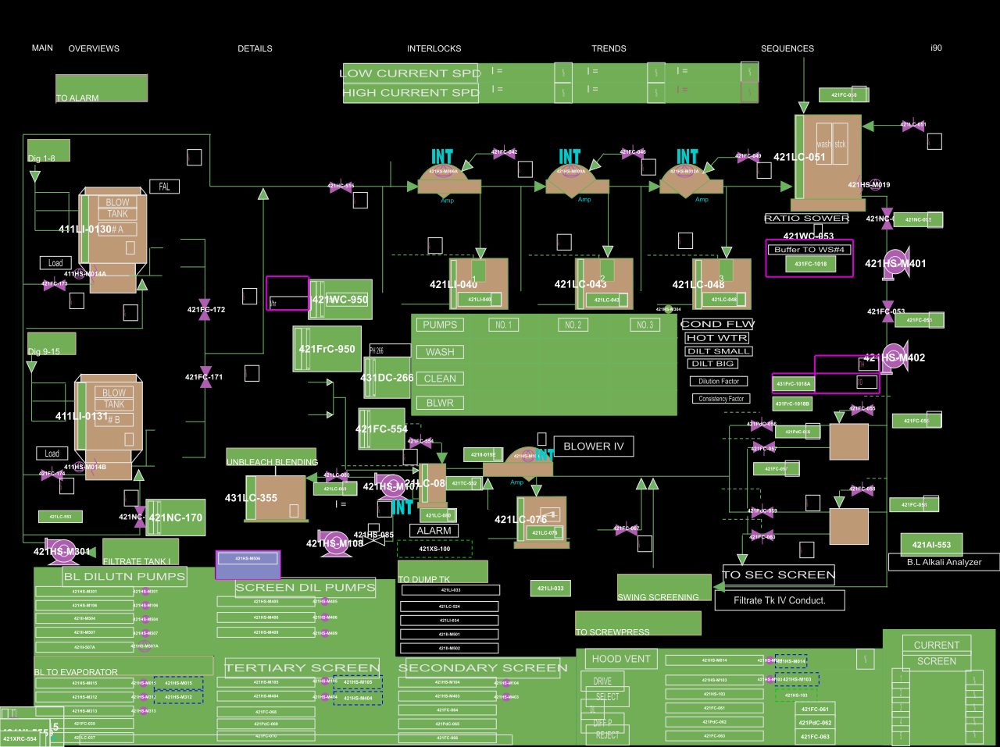
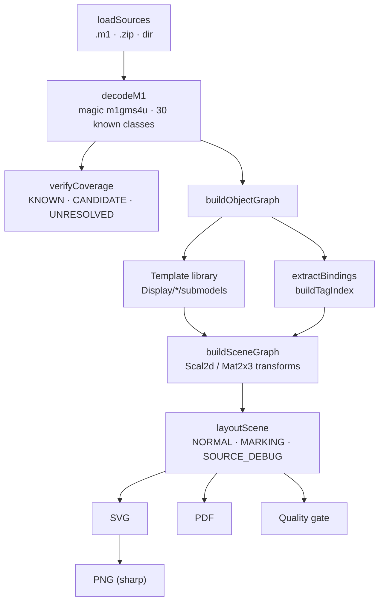
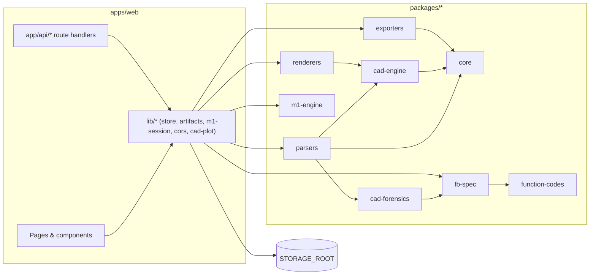
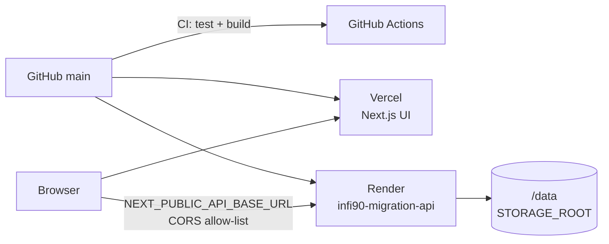

<div align="center">


<br/><br/>



# ABB Bailey INFI 90 Migration Studio

### Source-First Decoding, Reconstruction and Validation of Legacy INFI 90 Engineering Data

**CAD Logic • I/O List • Loop List • Function-Block Specifications • M1 Graphics • Traceability**

The studio reads ABB Bailey INFI 90 controller backups, the binary SCAD `.CAD` logic sheets with their cross-reference listings plus the binary `.m1` operator displays, and turns them into reviewable engineering deliverables. Every value in those deliverables can be traced back to the source file it came from.

<br/>

[](.github/workflows/ci.yml)


</div>

---

## Implementation Status

This table separates what the code does today from what is only planned. Each row was checked against the source on 2026-10-06.

| Component | Status | Notes |
|---|---|---|
| CAD package ingestion (ZIP) | ✅ Implemented | Extraction rejects path traversal and enforces size limits (`packages/parsers/src/zip.ts`) |
| SCAD `.CAD` binary decoding | ✅ Implemented | Native record and trailer decoder in `packages/cad-engine` |
| Source-faithful sheet reconstruction (SVG/PDF) | ✅ Implemented | `reconstructModule`, which needs the `.LBR` symbol libraries |
| I/O List | ✅ Implemented | Viewer plus `IO_List.xlsx` |
| Loop List | ⚠️ Partial | Loops are grouped from wiring-derived loop tags. The data model resolves ranges and units, but the exported row currently leaves the MIN/MAX/UNIT and context columns blank (see [Loop List](#loop-list)). |
| Logic / function-block specifications | ✅ Implemented | S1…SN values per block, block summary, logic report PDF |
| CAD Viewer | ✅ Implemented | Original-PDF and SVG views, search, linked I/O and Logic panels |
| M1 graphics decoding | ✅ Implemented | `packages/m1-engine`. The decoder claims partial semantic coverage, never full decoding. |
| Graphics Viewer | ✅ Implemented | Original and tag-marked views, user-defined categories, PDF/ZIP export |
| Automated tests | ⚠️ Partial | Each engine package has a test suite, but CI runs only the `@infi90/parsers` suite. There are no UI, API or end-to-end tests. |
| Production deployment | ⚠️ Partial | Vercel UI and Render API are live. Per the [deployment report](docs/PRODUCTION_DEPLOYMENT_REPORT.md), Render runs on the free tier without a persistent disk, so stored sessions are not durable. |
| Authentication / authorization | ❌ Not implemented | Session IDs are the only access control |
| Persistent database | ❌ Not used by design | Session state is stored as JSON files on disk |

---

## Table of Contents

1. [What Is ABB Bailey INFI 90 Migration Studio?](#what-is-abb-bailey-infi-90-migration-studio)
2. [Project Overview](#project-overview)
3. [Technology Configuration](#technology-configuration)
4. [Live Production Links](#live-production-links)
5. [Key Features](#key-features)
6. [System Architecture](#system-architecture)
7. [Complete Workflow](#complete-workflow)
8. [Engineering Modules](#engineering-modules)
9. [Engineering Outputs](#engineering-outputs)
10. [Source-to-Output Traceability](#source-to-output-traceability)
11. [Engineering Data Fidelity](#engineering-data-fidelity)
12. [User Guide](#user-guide)
13. [Developer Guide](#developer-guide)
14. [Project Architecture](#project-architecture)
15. [Folder Structure](#folder-structure)
16. [Backend Architecture](#backend-architecture)
17. [Frontend Architecture](#frontend-architecture)
18. [API Architecture](#api-architecture)
19. [Processing / Migration Engine](#processing--migration-engine)
20. [Data Architecture](#data-architecture)
21. [UI / UX Architecture](#ui--ux-architecture)
22. [Deployment](#deployment)
23. [Performance](#performance)
24. [Security](#security)
25. [Testing and Quality Assurance](#testing-and-quality-assurance)
26. [Error Handling](#error-handling)
27. [Future Scope](#future-scope)
28. [System Rating](#system-rating)
29. [A Message for Developers](#a-message-for-developers)
30. [Contribution](#contribution)
31. [Contact](#contact)
32. [Related Documents / Appendix](#related-documents--appendix)
33. [Environment Variable Catalog](#environment-variable-catalog)

---

# What Is ABB Bailey INFI 90 Migration Studio?

### In plain terms

ABB Bailey INFI 90 is a legacy distributed control system. Its control strategy was engineered as graphical function-block logic sheets and stored in proprietary binary files. The operator displays were stored in a separate binary graphics format. When a plant moves off INFI 90, the engineering team needs that information in a readable, reviewable form: which I/O points exist, which control loop each one belongs to, which function blocks implement the loop and with what parameters, and what the operator screens looked like.

Re-entering that information by hand from printouts is slow and error-prone. Migration Studio decodes it directly from the controller backup files and produces the same deliverables an engineering team would otherwise compile manually. It never invents a value it cannot read from the source.

### In technical terms

The studio runs two independent decoding pipelines inside one Next.js application:

| Pipeline | Input | What is decoded | Outputs |
|---|---|---|---|
| **CAD Engineering Intelligence Engine** | One Bailey Bus/Module backup as a `.zip`, containing `.CAD` sheets, `I90XREF.OUT/.ERR/.XRF`, `.REF`, `.VFY`, `.BND`, `.MHD`, `.CFG`, `.LST` and related files | The SCAD 5.3 record stream (polylines, primitives, text, symbol instances), the `BCCo SPC LIST` specification trailer, function codes and block numbers, IREF/OREF connectors, wire topology, cross-sheet references, title-block descriptions and I/O tags | I/O List, Loop List, Block Summary, per-sheet logic with S1…SN values, reconstructed sheets (SVG/PDF), logic report PDF |
| **M1 HMI Reconstruction Engine** | One or more `.m1` operator-display files, or a `.zip` of them | The `m1gms4u` record stream (Model, Group, ModInst, Text, Point, transform and G_* primitive records), template submodels, tag bindings and colour indices | Original display and tag-marked display (SVG/PDF/PNG) per graphic, decoded CSV/JSON tables, coverage diagnostics, PDF/ZIP exports grouped by category |

Both pipelines follow the same rule: geometry, text and engineering values come only from decoded bytes. Values that cannot be proven are kept and labelled (`UNRESOLVED`, `AMBIGUOUS`, `CANDIDATE`, `NOT_PRESENT`) instead of being filled in. Two things make this practical:

- **Determinism:** the same input produces byte-identical output, which tests assert for both the CAD and M1 renderers.
- **Traceability:** every record keeps the file, sheet, block and channel it came from.

---

# Project Overview

| Attribute | Description |
|---|---|
| Project | ABB Bailey INFI 90 Migration Studio |
| Domain | Industrial automation: legacy DCS engineering-data migration |
| Primary purpose | Decode INFI 90 CAD logic and M1 graphics backups into traceable engineering deliverables |
| Input | Bus/Module ZIP backups (CAD); `.m1` files or ZIPs (graphics) |
| Processing | In-process TypeScript decoders. CAD runs synchronously inside the upload request; M1 runs as a background job inside the same server process. |
| Output | XLSX workbooks, PDF and SVG drawings, PDF logic report, M1 PDF/ZIP exports, JSON session data |
| Architecture | npm-workspaces monorepo: one Next.js app (UI plus Route Handlers) and 9 domain packages |
| Frontend | Next.js 15.5 App Router, React 19.1, Tailwind CSS 4, pdf.js |
| Backend | Next.js Route Handlers on the Node.js runtime |
| Database | None. JSON session files under `STORAGE_ROOT`. |
| Deployment | UI on Vercel; API, processing and storage on Render (Node or Docker) |
| Primary users | Control/automation engineers and migration project engineers |
| Development status | Version `0.1.0`. Functionally complete for CAD and M1 decoding; production hardening (auth, persistence, job queue) is outstanding. |

---

# Technology Configuration

### Frontend

| Technology | Role in This Project |
|---|---|
| Next.js `^15.5.24` (App Router) | Pages, routing, server rendering and the build pipeline for `apps/web` |
| React `19.1.0` | UI components for the landing page, processing screen, CAD workspace and M1 viewer |
| TypeScript `^5` | Strict typing across the app and all packages |
| Tailwind CSS `^4` with `@tailwindcss/postcss` | Utility styling, combined with the project's own design-token CSS |
| pdfjs-dist `^6.3.289` | Renders the original plot PDF to canvas in the CAD Viewer, including text-layer search highlighting |
| `next/font` (Inter, IBM Plex Mono, Manrope, Outfit) | Self-hosted web fonts loaded in `app/layout.tsx` |

### Backend

| Technology | Role in This Project |
|---|---|
| Next.js Route Handlers (`runtime = "nodejs"`) | All API endpoints under `apps/web/src/app/api` |
| Next.js Middleware | CORS allow-list for `/api/*` (`apps/web/src/middleware.ts`) |
| Node.js `>=20` | Runtime for the app, decoders and scripts. CI uses Node 22 and Docker uses Node 20. |
| Node `fs` | Session store, uploads, artifacts and job status files |

### APIs

| Technology | Role in This Project |
|---|---|
| REST over HTTP (JSON, multipart, binary downloads) | Upload, session, logic, drawing, export and health endpoints |
| `multipart/form-data` | CAD ZIP upload (`file`) and M1 upload (`files`, plus an optional `reference` PDF) |
| Polling (`GET /api/m1/[id]/status`) | Progress reporting for M1 background jobs |

### Database / Storage

| Technology | Role in This Project |
|---|---|
| Filesystem session store (`apps/web/src/lib/store.ts`) | `sessions/<id>/project.json` plus artifacts, under `STORAGE_ROOT` |
| Render persistent disk (`render.yaml`: 10 GB at `/data`) | Intended production storage. Not attached in the current free-tier deployment (see [Deployment](#deployment)). |
| In-memory `Map` caches | Server: cad-logic, loop-list and plot-build deduplication. Client: result prefetch. |

### Processing / Migration Engine

| Technology | Role in This Project |
|---|---|
| `@infi90/cad-engine` | SCAD 5.3 `.CAD`/`.LBR` binary decoder, source-faithful reconstruction, SVG/PDF writers, v2 layout engine |
| `@infi90/parsers` | ZIP extraction, file classification, OUT/REF/XRF/ERR parsing, pipeline orchestration, loop tags, Loop List |
| `@infi90/core` | Domain types, I/O correlation, project validation, Loop List columns |
| `@infi90/fb-spec` | Function-block specification extraction, connection tracing, validation checks |
| `@infi90/function-codes` | Knowledge base of 134 function codes parsed from the Composer *Function Code Application Manual*, plus the spec payload decoder |
| `@infi90/cad-forensics` | Scene graph, terminal resolution, S1…SN and plot-stamp overlays, golden-digest verification |
| `@infi90/renderers` | CAD/M1 SVG and simple vector PDF rendering |
| `@infi90/exporters` | Excel workbooks |
| `@infi90/m1-engine` | M1 binary decoder, template library, bindings, scene graph, SVG/PDF/PNG rendering, reference validation |
| adm-zip `^0.5.16` | ZIP reading for CAD and M1 packages |
| exceljs `^4.4.0` | Writes `IO_List.xlsx`, `Loop_List.xlsx` and `Block_Summary.xlsx` |
| xlsx (SheetJS 0.20.3) | Reads reference `.xls` spreadsheets in the parsers and tests |
| pdf-lib `^1.17.1` | Merges per-sheet plot PDFs and M1 graphics PDFs in the web app |
| sharp (resolved through Next.js; not declared in `m1-engine`) | Rasterises M1 SVG to PNG |

All CAD and M1 PDF writers in the engine packages are hand-written, with no PDF library involved.

### Deployment

| Technology | Role in This Project |
|---|---|
| Vercel (`vercel.json`) | Hosts the production UI |
| Render (`render.yaml`) | Hosts the API, processing and storage (`infi90-migration-api`) |
| Docker (`Dockerfile`, multi-stage, `node:20-bookworm-slim`) | Container image with a built-in `HEALTHCHECK` on `/api/v1/health` |
| GitHub Actions (`.github/workflows/ci.yml`) | Runs install, parser tests and the production build on every push to `main` and every pull request |

### Development Tools

| Technology | Role in This Project |
|---|---|
| npm workspaces | Monorepo dependency management (`apps/*`, `packages/*`) |
| tsx `^4.20.5` | Runs TypeScript tests, CLIs and scripts without a build step |
| ESLint `^9` with `eslint-config-next` | Linting for `apps/web` (`eslint.config.mjs`) |
| `tools/*` scripts | Reverse-engineering, census and golden-master utilities (not shipped in the Docker context) |

### Testing / QA

| Technology | Role in This Project |
|---|---|
| `node:test` via `tsx --test` | Test suites in parsers, cad-engine, fb-spec, function-codes, cad-forensics and m1-engine |
| Golden masters | `packages/m1-engine/test/golden/*.json` (10 files); `packages/cad-forensics/golden/M10.digest.json` |
| `scripts/smoke-m5.ts` | Offline end-to-end smoke test against `Input/M5.zip` |

### Documentation / Reporting

| Technology | Role in This Project |
|---|---|
| Markdown reports in `docs/` | Reverse-engineering, QA, layout-engine and deployment reports |
| Generated PDFs | `CAD_Logic.pdf`, logic report, M1 category PDFs |
| CSV/JSON diagnostics | M1 decoded tables and coverage; `docs/cad-engine-qa-per-file.csv` |

---

# Live Production Links

These links were checked from this workstation on **2026-10-06**.

| Environment | URL | Purpose | Status |
|---|---|---|---|
| Production UI | https://abb-bailey-infi90-migration-studio.vercel.app | Web application | ✅ HTTP 200; serves "ABB Bailey INFI 90 Migration Studio \| Valmet" |
| Production API | https://infi90-migration-api.onrender.com | Migration API, processing and storage | ✅ Reachable |
| Health | https://infi90-migration-api.onrender.com/api/v1/health | Liveness and storage check | ✅ `{"status":"healthy", …}` |
| Former UI alias | https://infi90-migration-studio.vercel.app | Named as production in [docs/PRODUCTION_DEPLOYMENT_REPORT.md](docs/PRODUCTION_DEPLOYMENT_REPORT.md) | ❌ Returned 404 on 2026-10-06 |
| Former UI alias | https://abb-bailey-infi-90-migration-studio.vercel.app | Listed in the CORS defaults | ❌ Returned 404 on 2026-10-06 |
| Repository | https://github.com/valmet-intern-official/ABB-Bailey-INFI-90-Migration-Studio | Source code | ✅ |
| API docs | — | No OpenAPI/Swagger spec exists | Not verified in the current repository |

When the UI is served from Vercel, the browser calls the Render API. It uses `NEXT_PUBLIC_API_BASE_URL` if set; otherwise `apps/web/src/lib/api-base.ts` falls back to `https://infi90-migration-api.onrender.com` on Vercel builds. Vercel's own `/api/*` routes cannot store sessions, because serverless functions have no persistent writable filesystem. Free Render instances also spin down when idle, so the first request after a pause can take about 50 seconds.

---

# Key Features

### Migration and conversion
- ✅ Single-ZIP ingestion of a Bus/Module backup. The archive is parsed only; nothing inside it is executed.
- ✅ Classification of every file into one of 16 kinds: CAD, M1, OUT, REF, XRF, ERR, CFG, VFY, LST, LOG, MHD, MDC, BND, GES, BAT, OTHER.
- ✅ Loop, PCU and module provenance read from `L<n>/P<n>/M<n>` path segments.
- ✅ A re-decode of a stored upload, which keeps the same session id (`POST /api/projects/[id]/redecode`).

### CAD engineering
- ✅ A native decoder for SCAD records and the `SPC LIST` trailer. The 2026-09 corpus run decoded 762,038 of 762,038 records with zero unknown records ([QA report](docs/cad-engine-qa-report.md)).
- ✅ Function blocks with block number, function code and S1…SN specification values, labelled from the function-code manual and `.VFY` spec names.
- ✅ IREF/OREF connectors, wire nets and junctions, and cross-sheet reference resolution against `I90XREF.OUT`. Each reference is classified as `RESOLVED_INTERNAL`, `RESOLVED_CROSS_SHEET`, `RESOLVED_EXTERNAL`, `BOUNDARY_SIGNAL`, `AMBIGUOUS` or `UNRESOLVED`.
- ✅ Title-block area and page descriptions, taken from the `.LBR` frame symbol labels.
- ✅ Loop tags taken only from drawn CAD labels, found by walking the wiring graph from each I/O point.
- ✅ Block Summary of all function-block usage across the module.

### Graphics engineering
- ✅ M1 record decoding with byte-level coverage accounting (`KNOWN`, `CANDIDATE`, `UNRESOLVED`).
- ✅ Template (submodel) instantiation from the bundled display library, plus affine transforms (Scal2d/Mat2x3, 16.16 fixed point).
- ✅ Tag-binding extraction (`tag`, `tag-atom`, `navigation`, `color`, …) and a tag index.
- ✅ Original, tag-marked and source-debug renderings from a single draw list.
- ✅ User-defined categories, with export to one PDF or a ZIP of category PDFs.
- 📌 Optional reference-PDF calibration is supported by the API and CLI but not exposed in the upload UI.

### Validation
- ✅ Project checks: XRF sheet-count coverage, blank descriptions from XRF, unresolved references from ERR, and partial I/O mapping.
- ✅ fb-spec checks: `no_invented_values`, `manual_match`, `address_targets`, `connections_traceable`, `determinism` and others (CLI and tests).
- ✅ The M1 quality gate, including "No AI-generated graphics" and "deterministic output" checks.

### Platform
- ✅ A landing page with two upload tools, a processing screen with progress, the CAD workspace and the M1 viewer.
- ✅ Downloadable XLSX, PDF and ZIP deliverables, generated per session.
- ✅ Health endpoints, structured JSON logs, and a CORS allow-list.
- ❌ No authentication, user accounts or project library (`GET /api/projects` returns `410`).

---

# System Architecture



| Layer | Purpose | Major modules | Data flowing through |
|---|---|---|---|
| Presentation | Upload, progress, review and export | `app/page.tsx`, `app/studio/processing`, `app/workspace/[id]`, `app/m1/[id]` | Files out; JSON, SVG and PDF in |
| API / application | Validate requests, orchestrate pipelines, serve artifacts | `app/api/**/route.ts`, `middleware.ts`, `lib/*` | Multipart uploads, JSON, binary downloads |
| Orchestration | Run the CAD pipeline synchronously; run M1 jobs in the background | `parsers/pipeline.ts`, `lib/m1-session.ts`, `lib/artifacts.ts` | Extract dirs, job status files |
| Parsing / extraction | Decode binary and text formats | `cad-engine`, `parsers`, `m1-engine` | Raw bytes in, typed records out |
| Normalization / mapping | Correlate I/O, logic, loop tags and sheets | `core/correlate.ts`, `parsers/loop-tags.ts`, `parsers/loop-list.ts` | `CorrelatedProject`, `LoopList` |
| Validation | Report gaps and unproven values | `core/correlate.ts` (`buildValidation`), `fb-spec/validate.ts`, M1 quality gate | `ValidationIssue[]`, gate items |
| Output generation | Workbooks, drawings, reports | `exporters`, `renderers`, `cad-engine/reconstruct/pdf.ts`, `lib/m1-export.ts` | XLSX, PDF, SVG, ZIP |
| Persistence | Session and artifact storage | `lib/store.ts`, `lib/m1-session.ts` | JSON and binary files |

---

# Complete Workflow

```mermaid
flowchart LR
    A["Landing page<br/>StudioUpload"] --> B{"Package type"}
    B -->|".zip Bus/Module"| C["POST /api/projects/upload"]
    B -->|".m1 / .zip"| D["POST /api/m1/upload → 202"]
    C --> E["Validate: .zip, non-empty, ≤ MAX_UPLOAD_MB"]
    E --> F["Safe extract → classify inventory"]
    F --> G["Parse OUT · REF · XRF · ERR"]
    G --> H["Decode CAD sheets → correlate sheets"]
    H --> I["Reconstruct (LBR) → overlays"]
    I --> J["Correlate I/O + logic → validation"]
    J --> K["Assign loop tags from CAD labels"]
    K --> L["writeArtifacts: XLSX · PDF · SVG · cad-logic.json"]
    L --> M["/workspace/[id]"]
    D --> N["runM1Job: decode → scene → render per file"]
    N --> O["Poll /api/m1/[id]/status"]
    O --> P["/m1/[id]"]
    M --> Q["Download deliverables"]
    P --> Q
```



| Stage | Input | Processing | Output | Failure conditions |
|---|---|---|---|---|
| 1. Upload | Files chosen on the landing page | `setPendingJob`, then navigation to `/studio/processing`; XHR upload with progress | Multipart request | A hard refresh loses the pending job and the page redirects to `/#studio` |
| 2. Package validation | Multipart form | Extension, empty-file and size checks | Accepted upload saved to `uploads/` | 400 (wrong type or empty); 413 (too large) |
| 3. Extraction | ZIP | `extractZip`: rejects absolute paths, `..` and drive letters; max 200 MB per entry and 800 MB total | `work/<ts>/extract/` | Error is thrown, and the request returns 500 with the message |
| 4. Classification | Extracted files | `classifyFiles`, `parseProvenanceFromPath` | `InventoryFile[]` | Unknown extensions become `OTHER` |
| 5. Listings | OUT/REF/XRF/ERR | `parseOutFile`, `parseRefFile`, `parseXrfFile`, `parseErrFile` | I/O source entries, expected sheet count, error lines | A missing listing yields no entries; it is reported through validation |
| 6. CAD decode | `.CAD` files | `parseCadFile`: native `decodeCadSheet`, falling back to a string-scrape model | `CadSheetParse[]` | A sheet that does not decode keeps its scraped model |
| 7. Reconstruction | Sheets, `.LBR`, support files | `reconstructModule` plus cad-forensics overlays | Drawing models and SVG, title descriptions | On failure a warning is logged and the step-6 models are kept |
| 8. Correlation | All parsed data | `correlateProject` | `IoRecord[]`, `LogicRecord[]`, `ValidationIssue[]` | — |
| 9. Loop tags | Wiring graph | `applyCadLoopTags`: walks up to 6 hops; a scoring tie leaves the tag unassigned | `loopTag`, `loopTagBlock`, `mappingStatus` | No single winner means no tag |
| 10. Artifacts | `CorrelatedProject` | `writeArtifacts` | XLSX, PDF, SVG, `cad-logic.json` | Each step's error is collected in `artifactErrors`; it does not abort the run |
| 11. Review and export | Session | Workspace or M1 viewer | Downloads | 404 when a session or artifact is missing |

The M1 path (stages 2 to 10) runs as a background job. Each file is decoded, rendered and written as soon as it is ready, and `status.json` is updated at most every 500 ms. A job that has not reported progress for 3 minutes is reported as failed, because that usually means the server restarted.

---

# Engineering Modules

## CAD

<div align="center">

<br/><sub>Sheet 20710A1C.CAD (M10 reference module), redrawn by the source-faithful reconstruct engine. Asset: <code>apps/web/public/media/cad-20710A1C.svg</code>.</sub>
</div>

### CAD processing flow



## Loop List

The Loop List is **relationship-driven**. Loops are formed from engineering relationships and never from row order. The module header in `packages/parsers/src/loop-list.ts` states this, and a test asserts that shuffling the input records produces an identical result.

**How a loop is formed**

1. **Loop tags.** `extractLoopTags` (`packages/parsers/src/loop-tags.ts`) finds loop-tag labels drawn on the CAD sheets and attaches each to the block directly above it. Starting at each I/O tag, it walks the decoded wiring graph for up to 6 hops (`via: "wiring"`). It also collects labels on the same sheet (`"same-sheet"`) and labels in the module that share the loop number (`"loop-number"`). Candidates are scored on ISA naming agreement and hop count. If no single candidate wins, **no tag is assigned**.
2. **Grouping.** `buildLoopList` groups I/O records by canonical loop tag. A record without a tag stays in its own group and produces no Loop List row.
3. **Sides.** AI and DI records are input-side devices (Device Tag 1). AO and DO records are output-side devices (Device Tag 2).
4. **Side status.** A side with no device is `UNRESOLVED`. A side with more than one distinct card type and device tag is `AMBIGUOUS`; all candidates are kept, joined with `" | "`, and none is guessed. A side with exactly one is `RESOLVED`. A loop is `MAPPED` only when both sides are resolved.

**Columns** (`LOOP_LIST_COLUMNS`, `packages/core/src/loop-list.ts`):

| Field | Current exported value |
|---|---|
| `$(PACKAGE)` | Blank (the model holds the session module name as `DERIVED`) |
| `Process Area ID` | Blank (the model derives it from the first three digits of the loop tag) |
| `$(EXE)` | Blank (the model derives loop-PCU-module from the CAD file stem) |
| `$(CTRLROOM)` | Blank (`UNRESOLVED`: not present in the CAD package) |
| `$(ALGROUP)` | Blank (`UNRESOLVED`: not present in the CAD package) |
| `$(NAME40_1)` | Description of the Device Tag 1 point (title-block page description) |
| `$(TAG)` | Canonical loop tag |
| `$(CARDTYPE1)` | Input-side card type (AI/DI), or `UNRESOLVED` / `AMBIGUOUS` |
| `$(DEVICETAG1)` | Input-side device tag |
| `$(DEVICETAG1:MIN)` | Blank in the export (see below) |
| `$(DEVICETAG1:MAX)` | Blank in the export |
| `$(DEVICETAG1:UNIT)` | Blank in the export |
| `$(CARDTYPE2)` | Output-side card type (AO/DO) |
| `$(DEVICETAG2)` | Output-side device tag |
| `$(DEVICETAG2:MIN)` | Blank in the export |
| `$(DEVICETAG2:MAX)` | Blank in the export |
| `$(DEVICETAG2:UNIT)` | Blank in the export |

**Ranges and units in the model.** `buildLoopList` resolves engineering ranges from decoded slave-block specifications, and each value carries a status (`EXTRACTED`, `DERIVED`, `UNRESOLVED`, `NOT_APPLICABLE`) with evidence text:
- **AI:** read from FC132, with zero at `S(2+3k)` and span at `S(3+3k)`.
- **AO:** read from FC149, with zero at `S(18+2i)` and span at `S(19+2i)`.
- **MAX:** zero + span, added exactly as decimal text.
- **AI unit:** the engineering-unit *identifier* from the loop block (FC30 S2, FC80 S12). The unit text itself lives in the console engineering-unit table, which is not part of the CAD package.

`loopListCells` currently writes these six cells, and the five context columns, as empty strings. A unit test asserts that behaviour. ⚠️ Populating them from the model is an open item; see [Future Scope](#future-scope).

**Row layout** (`loopListRows`). One row per loop when each side has at most one device. When one side has several devices, there is one row per device and the single opposite device repeats. When both sides have several, inputs and outputs are listed on separate rows rather than paired.

## I/O List

`correlateProject` (`packages/core/src/correlate.ts`) builds the I/O List from `I90XREF.OUT`:

- **Identity:** one `IoRecord` per physical point. `parseIoTag` splits a raw tag such as `DO5-40B/282MCR-M360` into type, channel, slave and device tag.
- **Primary sheet:** the slave sheet, matched by slave number. Other sheets referencing the point go into `destinationCads`.
- **Loop tag:** filled only from a drawn CAD label (`loopTagSource: "CAD_LABEL"`). `loopTagBlock` records the sheet, block, function code, how the tag was found (`wiring`, `same-sheet`, `loop-number`) and the hop count.
- **Description:** the loop sheet's title-block page description.
- **`mappingStatus`:** `mapped` when a page description exists, otherwise `partial`.

**Columns** (viewer and `IO_List.xlsx`): CAD, Type, Ch, Slave, Device, Loop tag, Description. Rows are sorted by CAD and raw tag, with the CAD cell merged across each group.

**Validation.** The `io-list.test.ts` suite checks the M10 module against the vendor reference spreadsheet `Guiding Material/Test 2 Data - CAD/Expected Output - IO List.xls`:
- every OUT point is listed exactly once
- fields are copied verbatim from the tag
- each point sits on its slave sheet
- loop tags come only from labels
- known discrepancies are pinned explicitly

## Logic

Each decoded function block keeps the following:

| Element | Source |
|---|---|
| Block number | Type-6 symbol record, and the trailer entry |
| Function code | Numeric FC from the `SPC LIST` trailer, named from the knowledge base (e.g. FC80 *Control Station*, M/A-M) |
| S1…SN specifications | Trailer payload, decoded with `TYPE_WIDTH {I:2, B:2, R:4}`. Reals are formatted as the vendor prints them (`formatG`). |
| Spec labels, defaults, ranges | `@infi90/function-codes` (manual) plus `.VFY` spec names |
| IREF / OREF | Connector symbols (`IREFO` is treated as an OREF), resolved through the zone grid and `I90XREF.OUT` |
| Wires / connections | Type-1 polylines joined into nets; dangling wires stay `UNRESOLVED` |
| Sub-blocks (N+k outputs) | Output offsets from the manual schema, drawn as overlays by cad-forensics |

Spec decoding results are `DECODED`, `LAYOUT_MISMATCH` or `LAYOUT_UNRESOLVED`. A payload that does not close against the manual schema is left undecoded instead of being forced into shape.

The Logic tab lists every sheet's blocks with **Block, FC, Block description, Spec, Value, Description**. Hovering a value shows its type, default and range. **Generate Report** produces `<module>_Logic_Report.pdf`.

The **Block Summary** groups all blocks by function code (FC, name, symbol, count, CAD files) and expands to per-sheet block numbers. It exports as `Block_Summary.xlsx`, with "Block Summary" and "Block Locations" sheets.

## CAD Viewer

- **Original PDF view.** The sheet's plot PDF is rendered with pdf.js. When the archive contains a same-named PDF it is used as-is; otherwise the sheet is rendered with the deterministic `writePdf`. Zoom ranges from 0.25 to 6, with Ctrl/⌘ + wheel and fit-width. Search highlights matches in an overlay, and the PDF itself is never modified.
- **SVG view.** The reconstructed SVG, selected by `CAD_RENDER_ENGINE`, zooms from 0.25 to 5 around the cursor.
  - Clicking a block (`data-block-id`) jumps to its logic card.
  - Clicking a wire (`data-connection-id`) highlights the net.
  - I/O labels open a popover listing the related sheets.
- **Search.** Shows an "n of m" counter. Enter and Shift+Enter step through matches, Esc clears, and Ctrl/⌘+F focuses the search box.
- **Sheet details pane.** Shows **I/O list (n)** and **Logic (n)** for the current sheet. The pane is resizable by drag or keyboard, and its width is saved in `localStorage`.
- **Export PDF.** Downloads all sheet plots merged into `<module>_CAD_Sheets.pdf`.

## Graphics

<div align="center">

<br/><sub>M1 display 421P01, decoded from its binary graphic file and redrawn. Asset: <code>apps/web/public/media/graphics-421P01.png</code>.</sub>
</div>

### Graphics processing flow



### Graphics Viewer

The M1 engine reconstructs a display **only from decoded records**. The quality gate in `packages/m1-engine/src/pipeline/run.ts` checks these statements explicitly:

- "No AI-generated graphics — renderer is a deterministic function of decoded records"
- "No manually arranged process layout — all positions come from decoded coordinates and transforms"
- "No invented engineering values"
- "Re-running the same M1 produces deterministic output". A second fresh decode must produce a byte-identical SVG.

How source fidelity is preserved:

- **Object identity:** every SVG element carries `data-obj`, which points back to its decoded record.
- **Hierarchy:** Model, Group and FillGroup children are walked recursively and exported to `groups.csv` with depth.
- **Templates:** `ModInst` instances are drawn from the bundled submodel library (190 Power Plant and 480 Fiber Line `.m1` submodels under `Guiding Material/Raw Data from Controller/Display`), through the instance transform. A missing template becomes a placeholder marked `TEMPLATE_GEOMETRY_UNRESOLVED`; nothing is invented to fill the gap.
- **Bindings:** `%#1#% NAME "value" … %#1#%` instance expressions are parsed. Each binding is classified (`tag`, `tag-atom`, `tag-dot-atom`, `navigation`, `color`, `number`, `text`) and given a status: `RESOLVED`, `UNRESOLVED`, `INCONSISTENT` or `LITERAL`. Expressions are not evaluated, so no runtime state is invented.
- **Colour:** M1 files store colour indices, not RGB. Indices 0–15 use an ANSI-16 fallback marked `ASSUMED`; other indices get a deterministic hash colour marked `UNKNOWN`. The palette source (`calibrated-from-reference`, `provided`, `fallback`) is recorded.
- **Views:**
  - **Original** shows the display as decoded.
  - **With marking tags** repaints tag text in red and adds navigation targets.
  - **source-debug** is written to the package for diagnosis.
- **Decode claim:** `semantics` is always `PARTIAL`. The engine never states that a file is fully decoded.

Known approximations, stated plainly: PDF text width is estimated, not measured. `scene/arrange.ts` (`placeLabels`) moves labels apart to avoid overlaps. Several format rules in `src/rules.ts` are still `CANDIDATE` rather than `PROVEN`.

**Viewer features** (`apps/web/src/app/m1/[id]/page.tsx`):
- Sidebar search, previous/next buttons and arrow-key navigation.
- Zoom from 0.25 to 8, Ctrl + wheel, and fit-width.
- Files that could not be decoded are listed as skipped, with their errors.
- **Categories** are user-defined groups of graphics, stored in `categories.json`.
- **Export Graphics** downloads one PDF, or a ZIP with one PDF per category. Each graphic contributes two pages: the original, then the tag-marked version.

---

# Engineering Outputs

| Output | Source | Purpose | Format | Validation |
|---|---|---|---|---|
| `IO_List.xlsx` | `ioRecords` | Physical I/O schedule | XLSX (rebuilt per download) | `io-list.test.ts` vs vendor `.xls` |
| `Loop_List.xlsx` | `buildLoopList` and `cad-logic.json` | Loop schedule, input and output devices | XLSX, text-formatted cells | `loop-list.test.ts` |
| `Block_Summary.xlsx` | `cad-logic.json` | Function-block usage by FC | XLSX, 2 sheets | — |
| `CAD_Logic.pdf` | `writeCadSpecPdf` | Sheets plus S1…SN tables | PDF | — |
| `<module>_CAD_Sheets.pdf` | Per-sheet plot PDFs, merged with pdf-lib | Complete drawing set | PDF | — |
| Per-sheet plot PDF | Archive PDF or `writePdf` | Original PDF view | PDF | Byte-identical render test |
| Per-sheet SVG | `cadSheetToSvg` | SVG view | SVG | Byte-identical render test |
| `<module>_Logic_Report.pdf` | `buildLogicReport` | Printable logic report | PDF | — |
| `cad-logic.json` | Spec extraction | Per-sheet block and spec data behind the Logic tab | JSON | fb-spec tests |
| `project.json` | `processModuleZip` | Full session model | JSON | — |
| M1 package (per file) | `packageFiles` | Original, marking and debug renders; decoded CSV/JSON; diagnostics; forensic dump | SVG, PDF, PNG, CSV, JSON | m1-engine golden masters |
| `M1-graphics-<id>.pdf` / `.zip` | `exportM1Graphics` | Graphics deliverable by category | PDF / ZIP | — |
| `Logic_Specification.xlsx` | `exportLogicExcel` | Offline logic export | XLSX | Produced only by `npm run smoke:m5`, not by the web app |

---

# Source-to-Output Traceability

```text
.CAD bytes ──decodeRecordStream / decodeTrailer──► DrawingSheet (blocks, pins, wires, IREF/OREF, S1…SN)
   │                                                 │  residualHex kept for unexplained bytes
I90XREF.OUT ──parseOutFile──► OutIoEntry ──correlateProject──► IoRecord { cadFile, slave, channel, rawIoTag }
   │                                                 │
wiring graph ──extractLoopTags──► loopTag + loopTagBlock { sheet, block, FC, via, hops }
   │                                                 │
buildLoopList ──► LoopRecord { fields with status + evidence, sourceRecords[] } ──► Loop_List.xlsx
ERR / XRF ──buildValidation──► ValidationIssue { sourceFile, relatedCad, resolutionStatus }
```

- **Per record:** each I/O record keeps its CAD file, slave and channel, and each loop record keeps its `sourceRecords`. A Loop List row expands in the UI to show its member records, each linking to its CAD sheet.
- **Per byte:** the CAD decoder keeps bytes that no schema field explains as `residualHex`. In the M1 engine every field carries a coverage status, and `forensic/record-index.csv` and `fields.csv` map output back to byte offsets.
- **Unresolved values:** these stay visible in the output (`UNRESOLVED`, `AMBIGUOUS`, `NOT_PRESENT`, `CONFLICT`, `RAW_ONLY`) and are never replaced by plausible defaults.

---

# Engineering Data Fidelity

The status vocabulary below is the one actually used in the code:

| Status | Where it is used | Meaning |
|---|---|---|
| `EXTRACTED` / `DERIVED` | Loop List fields, fb-spec specs, title-block text | Read directly from source / computed from source by a stated rule |
| `UNRESOLVED` | Everywhere (loops, references, specs, bindings, wires) | Evidence is insufficient; the value is left unresolved, not guessed |
| `AMBIGUOUS` | Loop sides, cross-sheet references | Several candidates are kept, and none is chosen |
| `MAPPED` / `partial` | Loop mapping status / I/O `mappingStatus` | Both sides resolved / description missing |
| `NOT_PRESENT` | fb-spec specs, cad-forensics | The field does not exist in the source |
| `CONFLICT` | fb-spec, cad-forensics | Sources disagree |
| `RAW_ONLY` | cad-forensics | Kept as raw source data only |
| `BOUNDARY_SIGNAL` | cad-engine reference resolution | A signal that leaves the module |
| `NOT_APPLICABLE` | Loop ranges for digital points | The field does not apply |
| `KNOWN` / `CANDIDATE` | M1 field coverage | Proven / plausible but unproven interpretation |

The statuses `UNMAPPED`, `CROSS-LOOP`, `INVALID` and `EXCLUDED` are **not used** in the current implementation.

**Principles enforced in code:**
- **Source-first:** values come only from decoded bytes.
- **Deterministic:** the same input gives byte-identical SVG and PDF, as tested in `cad-engine` and `m1-engine`.
- **No order-based inference:** the Loop List does not depend on row order (tested).
- **No fabricated values:** fb-spec has a `no_invented_values` check, and the M1 gate has "No invented engineering values".
- **Explicit gaps:** the [CAD QA report](docs/cad-engine-qa-report.md) lists what is *not* decoded, rather than claiming 100% extraction.

---

# User Guide

### Getting started
1. Open the application: the [production UI](https://abb-bailey-infi90-migration-studio.vercel.app), or `http://localhost:3000` locally.
2. No login is required. Each upload creates its own session; there is no shared project library.
3. Scroll to **Ready to engineer** (section 09), or click **Open Studio**.

### Uploading a package

| Tool | Accepts | Notes |
|---|---|---|
| **CAD Engineering Intelligence Engine** | One `.zip` Bailey Bus/Module backup | It should contain the `.CAD` sheets and the `I90XREF.OUT/.ERR/.XRF` listings. Samples: `Input/M5.zip`, `Input/M10.zip`. |
| **M1 HMI Reconstruction Engine** | One or more `.m1` files and/or `.zip` archives of them | Sample graphics: `Input/M5/*.m1` |

The default size limit is 100 MB (`MAX_UPLOAD_MB`). For CAD it applies per file; for M1 it applies to the combined upload.

### Running the migration
After you click **Analyze & open workspace** or **Decode & preview**, the processing screen shows the upload progress followed by the decode phases.

- **CAD:** the server processes the package in a single request, so the progress bar is an estimate after the upload completes.
- **M1:** progress is real, because the page polls the job status every 1.2 seconds.

When processing finishes, the studio opens the workspace or the M1 viewer automatically.

### CAD outputs
- **Overview:** file counts by type and a searchable inventory.
- **I/O List:** filter by AI/AO/DI/DO; click a CAD name to open that sheet; **Export IO List**.
- **Loop List:** filter by Control / Input only / Output only; click a row to see its member records; **Export Loop List**.
- **Logic:** per-sheet blocks and S1…SN values; **Generate Report**; **Open in CAD viewer**.
- **CAD Viewer:** Original PDF or SVG view, search, Sheet details pane, **Block Summary**, **Export PDF**.

### Graphics outputs
- Switch between **Original** and **With marking tags**.
- Create **Categories** to group displays.
- **Export Graphics** downloads one PDF, or a ZIP of category PDFs.

### Reviewing results
- `artifactErrors` in the upload response lists any artifact step that failed; the rest of the session is still usable.
- Validation findings come from XRF coverage, XRF blank descriptions, ERR unresolved inputs, and partial mappings. They are stored with the session (`project.json` → `validation`).
- `UNRESOLVED` or `AMBIGUOUS` in the Loop List means the source does not prove a single answer. Check the expanded member rows and the referenced CAD sheet.

### Troubleshooting

| Symptom | Cause | Resolution |
|---|---|---|
| "Please upload a .zip package." | A non-ZIP file was given to the CAD tool | Upload the module backup as `.zip` |
| HTTP 413 | The upload exceeds `MAX_UPLOAD_MB` | Raise `MAX_UPLOAD_MB` on the server or split the M1 upload |
| HTTP 429 on M1 upload | Two M1 jobs are already running (`MAX_CONCURRENT_JOBS = 2`) | Retry after a current job finishes |
| "Decoding was interrupted (the server restarted)…" | The M1 job made no progress for 3 minutes | Upload again |
| Processing page bounces back to the landing page | The page was refreshed during upload, so the pending job was lost | Start the upload again |
| A session link returns 404 later | Free-tier Render storage is ephemeral | Re-upload, or deploy with a persistent disk |
| First request is very slow | The Render free instance is cold-starting | Wait about 50 s, then retry |
| Logic tab shows **Generate from CAD** | `cad-logic.json` is missing for the session | Click it; this runs `/redecode` |

---

# Developer Guide

### Prerequisites

| Requirement | Version / source |
|---|---|
| Node.js | `>=20` (`package.json` engines); CI uses 22 and Docker uses 20 |
| npm | Bundled with Node (workspaces required) |
| OS | Any. Production runs on Linux, where **file paths are case-sensitive**. |

### Local development

```bash
git clone https://github.com/valmet-intern-official/ABB-Bailey-INFI-90-Migration-Studio.git
cd ABB-Bailey-INFI-90-Migration-Studio
npm install
cp .env.example .env.local      # leave NEXT_PUBLIC_API_BASE_URL empty for same-origin
npm run dev                     # http://localhost:3000
```

The UI and API run in the same Next.js process. No database, queue or worker needs to be started. With no `STORAGE_ROOT` set, sessions are written to `<repo-root>/data/`, which is git-ignored.

### Commands

| Command | Purpose |
|---|---|
| `npm run dev` | Next.js dev server |
| `npm run build` | Production build of `@infi90/web` |
| `npm run start -w @infi90/web` | Serve the production build |
| `npm run lint -w @infi90/web` | ESLint |
| `npm test` | `@infi90/parsers` tests (the same command CI runs) |
| `npm test -w @infi90/<pkg>` | Tests for `cad-engine`, `fb-spec`, `function-codes`, `cad-forensics` or `m1-engine` |
| `npm run typecheck -w @infi90/<pkg>` | `tsc --noEmit` for a package |
| `npx tsc --noEmit -p apps/web` | Type-check the web app |
| `npm run smoke:m5` | Offline pipeline smoke test on `Input/M5.zip`; writes to `apps/web/data/work-test/artifacts` |
| `npm run extract -w @infi90/m1-engine -- --input <path> --out <dir>` | M1 CLI (`--reference`, `--palette`, `--no-calibrate`, `--strict`) |
| `npm run golden:update -w @infi90/m1-engine` | Regenerate M1 golden masters after an intentional change |
| `npm run extract -w @infi90/fb-spec` / `npm run build-module -w @infi90/cad-forensics` | Package CLIs; see each `src/cli.ts` for arguments |

### Development workflow
1. Reproduce the behaviour with a real sample (`Input/M5.zip`, `Input/M10.zip`, `Input/M5/*.m1`).
2. Change the lowest package that owns the behaviour. Packages ship TypeScript source directly (`main: ./src/index.ts`) and are transpiled by Next.js (`transpilePackages`), so no package build step is needed.
3. Run that package's tests and the web type check, then upload through the UI to confirm.

### Build process
`next build` compiles the app together with all `@infi90/*` packages. `exceljs`, `adm-zip`, `sharp` and `xlsx` are kept as server externals. `outputFileTracingRoot` points at the monorepo root.

### Debugging
- The server logs one-line JSON events: `migration.upload.start`, `.complete` and `.failed`, and `m1.extract.start`, `.complete` and `.failed`.
- `GET /api/projects/<id>` returns the full session model (`rawStrings` are trimmed to 40 per sheet).
- For M1 problems, check `diagnostics/` and `forensic/` in the session's `package/<file>/` folder, and `quality-gate.json`.
- Set `CAD_RENDER_ENGINE=v2` or `v1` to compare renderers on the same sheet.

---

# Project Architecture



| Area | Implementation |
|---|---|
| Frontend | `apps/web/src/app` pages, `components/landing`, `components/processing`, `design-system` |
| Backend / API | `apps/web/src/app/api`, `apps/web/src/lib` |
| Processing engine | Nine `packages/*` workspaces |
| Database | None |
| Storage | Filesystem under `STORAGE_ROOT` |
| Workers | No separate worker. M1 jobs run as background promises in the web process. |
| Deployment | `vercel.json`, `render.yaml`, `Dockerfile`, `.github/workflows/ci.yml` |
| Tests | `packages/*/src/**/*.test.ts`, `packages/m1-engine/test` |
| Documentation | `docs/`, `Guiding Material/` |

---

# Folder Structure

```text
ABB-Bailey-INFI-90-Migration-Studio/
├── .github/workflows/ci.yml        # CI: npm ci → parser tests → production build
├── apps/
│   └── web/                        # @infi90/web — Next.js UI + API (single process)
│       ├── public/                 # logos, pdf.js worker, landing media
│       └── src/
│           ├── app/                # routes: /, /studio/processing, /workspace/[id], /m1/[id], /projects/[id]
│           │   └── api/            # route handlers (projects, m1, health, v1/health)
│           ├── components/         # landing/*, processing/*
│           ├── design-system/      # tokens, component CSS, guidelines
│           ├── lib/                # store, artifacts, cors, m1-session, cad-plot, loop-list, …
│           └── middleware.ts       # CORS for /api/*
├── packages/
│   ├── core/                       # types, correlation, validation, Loop List columns
│   ├── parsers/                    # ZIP, classify, OUT/REF/XRF/ERR/CAD/M1, pipeline, loop tags
│   ├── cad-engine/                 # SCAD binary decoder, reconstruct, SVG/PDF, v2 layout
│   ├── cad-forensics/              # scene graph, overlays, verification, golden digest
│   ├── fb-spec/                    # function-block specs, connections, validation checks
│   ├── function-codes/             # FC knowledge base (134 codes) + payload decoder
│   ├── renderers/                  # SVG + simple vector PDF
│   ├── exporters/                  # Excel workbooks (exceljs)
│   └── m1-engine/                  # M1 decoder, templates, bindings, render, tests, golden
├── scripts/smoke-m5.ts             # offline smoke test
├── tools/                          # reverse-engineering & census utilities (dev only)
│   ├── cad-forensics/  cad-gap/  fb-spec/  fc-manual/  golden-m5/  m1-explore/
├── docs/                           # reverse-engineering, QA and deployment reports
├── fixtures/m5/                    # parser test fixtures
├── Input/                          # sample packages: M5.zip, M10.zip, M5/, M10/, project spec
├── Guiding Material/               # vendor manuals, expected outputs, Display submodels, .LBR libraries
├── Dockerfile  render.yaml  vercel.json
├── .env.example                    # variable names only
└── package.json                    # npm workspaces root
```

`Guiding Material/Raw Data from Controller/` is git-ignored except for two parts the runtime needs: the M1 `Display/*/submodels/` template library and the CAD `.LBR` symbol libraries.

---

# Backend Architecture

| Concern | Implementation |
|---|---|
| Entry point | `next start` serving `apps/web`. Render runs `npm run start -w @infi90/web -- -H 0.0.0.0 -p $PORT`. |
| Routing | File-system Route Handlers in `apps/web/src/app/api/**/route.ts`, all on `runtime = "nodejs"` |
| CORS | `middleware.ts` plus `lib/cors.ts` and `lib/cors-origins.ts` |
| Orchestration | `processModuleZip` (CAD, synchronous); `startM1Session` → `runM1Job` (M1, background) |
| Artifact generation | `lib/artifacts.ts` (`writeArtifacts`), `lib/function-blocks.ts` (`writeCadSpecPdf`), `lib/cad-plot.ts`, `lib/block-summary.ts`, `lib/loop-list.ts`, `lib/m1-export.ts` |
| Persistence | `lib/store.ts` (`saveProject`, `loadProject`, `sessionArtifactsDir`); `lib/m1-session.ts` (`status.json`, `session.json`, `categories.json`) |
| Caching | Server `Map` caches keyed by file mtimes (`cad-logic-store.ts`, `loop-list.ts`); `cad-plot.ts` deduplicates concurrent plot builds |
| Concurrency | At most two M1 jobs (`MAX_CONCURRENT_JOBS`); CAD runs inside the request (`maxDuration = 300`) |
| Logging | Structured JSON via `console.info` / `console.error` |

---

# Frontend Architecture

| Concern | Implementation |
|---|---|
| Shell | `app/layout.tsx` (fonts, metadata, icons) |
| Landing | `app/page.tsx` → `SiteHeader`, Hero, Platform, Workflow, Reconstruction, Connectivity, Outputs, Traceability, Validation, FinalCTA (`StudioUpload`), Footer |
| Upload flow | `StudioUpload` → `lib/pending-job.ts` (in memory) → `/studio/processing` → `ProcessingView` (XHR upload, M1 status polling, result preloading) |
| CAD workspace | `app/workspace/[id]/page.tsx` with `loop-list-view.tsx`, `block-summary-view.tsx`, `cad-pdf-view.tsx`; tabs selectable with `?tab=`, sheets with `?cad=` |
| M1 viewer | `app/m1/[id]/page.tsx` |
| State | React local state; `lib/result-cache.ts` (in-memory prefetch); `localStorage` only for the detail-pane width |
| API calls | `fetch(apiUrl(path))` from `lib/api-base.ts` |
| Styling | Tailwind 4, `design-system/tokens/tokens.css` (`--ds-*`), `components/landing.css`, `components/processing.css`, `app/globals.css` |
| Responsiveness | Single-column layouts below 1100 px; three-pane CAD Viewer and sticky navigators from 1100 px up |

---

# API Architecture

All errors are JSON `{ "error": string }`, except `/api/m1/[id]/asset/*`, which returns plain text. No endpoint requires authentication.

| Method | Endpoint | Purpose | Request | Response |
|---|---|---|---|---|
| GET, OPTIONS | `/api/health`, `/api/v1/health` | Health check | — | `{status, service, timestamp, checks:{storage, migrationEngine}}`. 200, or 503 when storage is not writable. |
| GET | `/api/projects` | Project listing (disabled) | — | 410 |
| POST | `/api/projects/upload` | Upload and decode a CAD module | multipart `file` (.zip); optional `loop`, `cpu`, `module`, `name` | `{id, name, meta, stats, inventoryCount, validationCount, artifactErrors}`. 400/413/500. |
| GET | `/api/projects/[id]` | Session model | — | `CorrelatedProject` (404 if missing) |
| POST | `/api/projects/[id]/redecode` | Re-run the pipeline on the stored upload | — | `{id, cadSheets, nativeDecoded, blockTotal, connTotal, artifactErrors}`. 404/409. |
| POST | `/api/projects/[id]/artifacts` | Regenerate artifacts | — | `{ok, errors}` |
| GET | `/api/projects/[id]/artifacts/[kind]` | Download an artifact | `kind`: `io-xlsx`, `loop-xlsx`, `blocks-xlsx`, `cad-pdf` | File attachment. 400 for an unknown kind, 404 if missing. |
| GET | `/api/projects/[id]/block-summary` | Blocks grouped by FC | — | `{totalBlocks, sheetCount, rows[]}` |
| GET | `/api/projects/[id]/cad-logic` | Block and spec data for all sheets | — | `{sheets}` |
| GET | `/api/projects/[id]/cad-logic/[sheet]` | One sheet's blocks | — | `{blocks}` |
| GET | `/api/projects/[id]/cad-pdf` | Merged plot PDFs | — | `application/pdf` |
| GET | `/api/projects/[id]/cad-pdf/[sheet]` | One sheet's plot | — | `application/pdf` (inline) |
| GET | `/api/projects/[id]/cad-svg/[sheet]` | Sheet SVG (rendered live, falling back to the stored file) | — | `image/svg+xml` |
| GET | `/api/projects/[id]/logic-report` | Logic report | — | `application/pdf` |
| GET | `/api/projects/[id]/loop-list` | Loop list | — | `{loops, rows:[{loopId, cells}]}` |
| POST | `/api/m1/upload` | Start an M1 decode | multipart `files` (.m1/.zip); optional `reference` (.pdf) | 202 `{id, state:"running", statusUrl}`. 400/413/429/500. |
| GET | `/api/m1/[id]` | M1 session index | — | `{index}` |
| GET | `/api/m1/[id]/status` | Job progress | — | `{id, state, total, done, current, failures, error?, startedAt, updatedAt}` |
| GET, PUT | `/api/m1/[id]/categories` | Read or replace categories | PUT `{categories:[{id,name,files}]}` | `{categories}` |
| POST | `/api/m1/[id]/export` | Export graphics | `{categories?: string[], variant?}` | `application/pdf` or `application/zip`. `variant` is accepted but currently ignored. |
| GET | `/api/m1/[id]/asset/[...path]` | Serve a file from the session package | `?download` for an attachment | By extension (svg, png, pdf, json, csv, txt) |

---

# Processing / Migration Engine

| Engine | Responsibility | Input → Output | Key logic | Failure handling |
|---|---|---|---|---|
| ZIP extractor (`parsers/zip.ts`) | Safe unpacking | ZIP → extract dir | Path checks; per-entry 200 MB and total 800 MB caps; archive timestamps kept as plot stamps | Throws; the upload returns 500 |
| Classifier (`parsers/classify.ts`) | File inventory | Paths → `InventoryFile[]` | Extension map; `L/P/M` provenance | Unknown files become `OTHER` |
| Listing parsers | OUT / REF / XRF / ERR | Text or binary → entries | Section headers; tag-shaped strings | Missing file gives empty results, surfaced through validation |
| Record decoder (`cad-engine/records`) | SCAD record stream | `.CAD` bytes → records | 256-byte header; record types 1–12; `residualHex` for unexplained bytes | Unknown bytes are kept, not dropped |
| Trailer decoder (`cad-engine/records/trailer.ts`) | Spec values | `SPC LIST` → block, FC, payload | Per-file header gap solved; slot type candidates (`zero`/`float`/`integer`/`ambiguous`) | Ambiguous slots are marked |
| Reconstructor (`cad-engine/reconstruct`) | Drawing model | Sheets, `.LBR`, OUT/VFY/REF/BND/MHD → `DrawingSheet` | Library lookup by header name; pin templates; zone-grid calibration; `resolveReferences` | Falls back to step-6 models with a warning |
| Correlator (`core/correlate.ts`) | Engineering model | All parsed data → `CorrelatedProject` | One record per physical point; slave-sheet primary | Partial records are flagged |
| Loop tagger / Loop List (`parsers/loop-tags.ts`, `loop-list.ts`) | Loops | Wiring and records → `LoopList` | Bounded wiring walk; scored candidates; side status | Leaves the tag unset, or marks the side `UNRESOLVED`/`AMBIGUOUS` |
| fb-spec | Spec records and checks | Module → spec records and validation | Manual schema; `no_invented_values`; determinism | Diagnostic codes such as `LAYOUT_MISMATCH` and `UNKNOWN_FUNCTION_CODE` |
| M1 engine | Display reconstruction | `.m1` → package | Coverage-verified decode; templates; bindings; layout | Per-file failures are listed; other files continue |

**CAD render engines** (`CAD_RENDER_ENGINE`):
- **`source`** (default): the source-faithful reconstruct SVG.
- **`v2`**: hierarchical layout with orthogonal, obstacle-aware routing on A3.
- **`v1`**: the legacy source-coordinate paint renderer.

---

# Data Architecture

**No database is used.** Sessions are JSON files on disk:

```text
$STORAGE_ROOT/
├── sessions/
│   ├── proj_<rand>_<time>/
│   │   ├── project.json                 # CorrelatedProject
│   │   └── artifacts/                   # IO_List.xlsx, Loop_List.xlsx, Block_Summary.xlsx,
│   │                                    # CAD_Logic.pdf, cad-logic.json, cad-svg/, cad-plot/, cad-models/
│   └── m1-<16 hex>/
│       ├── status.json  session.json  categories.json
│       └── package/<file>/{source,decoded,graphics,diagnostics,forensic}/
├── uploads/<timestamp>_<name>.zip       # original CAD uploads (needed for /redecode)
└── work/<timestamp>/extract/            # extracted module
```

The main entities live in `packages/core/src/types.ts`:

| Entity | Contents |
|---|---|
| `CorrelatedProject` | `meta`, `inventory`, `ioRecords`, `logicRecords`, `cadSheets`, `graphics`, `validation`, `stats` |
| `IoRecord` | Type, channel, slave, device tag, raw tag, CAD file, loop tag and its evidence, description, `mappingStatus` |
| `LogicRecord` / `CadFunctionBlock` | Block id and number, function code, S0, S0.5, S1–S9, input and output refs |
| `LoopRecord` | Context fields with status and evidence, input/output endpoints, related devices, source records |
| `ValidationIssue` | Type, severity (`error`/`warning`/`info`), source file, related CAD/IO, `open`/`resolved` |

Nothing is ever deleted automatically: there is no retention policy or cleanup job.

---

# UI / UX Architecture

- **Visual language:** graphite and steel neutrals with a single green accent (`--ds-green-600 #1f7a4d`). Borders are preferred over shadows. Sans-serif type with IBM Plex Mono for engineering values. The design guidelines in `apps/web/src/design-system/guidelines/README.md` require source-first content with no mock dashboards or invented metrics.
- **Landing page:** nine numbered sections that use real sample data from the M10 reference module: sheet 20710A1C, display 421P01 and loop 131FC-163.
- **Processing:** an SVG progress ring and a canvas particle field. Phase changes are announced through `role="status"`, and errors through `role="alert"`.
- **Workspace and viewer:** Excel-style tables that scroll with the page, sticky navigators, and a three-pane CAD Viewer.
- **Accessibility:**
  - A skip link, `aria-labelledby` sections and `aria-current` navigation.
  - `aria-pressed` toggles, and `aria-live` search counts.
  - Modal dialogs with `aria-modal`, and a keyboard-operable pane resizer (`role="separator"`).
  - A keyboard-accessible dropzone.
  - `prefers-reduced-motion` honoured in CSS and JS; the hero video is skipped under reduced motion or Save-Data.
- **Authentication UI:** none.

---

# Deployment



### Production architecture
- **UI:** Vercel (`vercel.json`: `npm ci`, `npm run build`).
- **API, processing and storage:** Render web service `infi90-migration-api`.
  - `render.yaml` describes a Node runtime on the `starter` plan in Oregon, with `healthCheckPath: /api/v1/health` and a 10 GB disk at `/data`.
  - The [deployment report](docs/PRODUCTION_DEPLOYMENT_REPORT.md) (2026-09-20) records the live service as a **Docker free-tier instance without a disk**, so `/data` is ephemeral. Treat `render.yaml` as the target configuration rather than the current state.
- **Docker:** a three-stage build (deps → builder → runner) running as the `node` user, exposing port 3000, with a `HEALTHCHECK` on `/api/v1/health`.

### Environment setup
- **Render:** set `STORAGE_ROOT`, `CORS_ORIGINS` (the Vercel origin), `SERVICE_NAME` and `MAX_UPLOAD_MB`.
- **Vercel:** set `NEXT_PUBLIC_API_BASE_URL` to the Render origin, with no trailing slash.
- See the [Environment Variable Catalog](#environment-variable-catalog).

### Deployment steps
1. Push to `main`. CI runs the parser tests and the production build.
2. **Vercel** builds from the repository.
3. **Render** builds with `npm ci && npm run build`, or from the Dockerfile. The deployment report notes that auto-deploy was not linked at the time, so Render deploys were triggered manually.

### Health checks
`GET /api/v1/health` writes and deletes a probe file in `STORAGE_ROOT`. It returns 200 `healthy`, or 503 `degraded` when storage is not writable.

### Logging
Structured JSON lines go to stdout and stderr and appear in the Render and Vercel log streams.

### Rollback and monitoring
There is no rollback automation, alerting or metrics in the repository; use the platform's own redeploy and rollback controls. Monitoring is not verified in the current repository.

---

# Performance

| Aspect | Implemented behaviour |
|---|---|
| CAD processing | Synchronous inside the upload request (`maxDuration = 300` s). Locally, the 226-sheet M10 module took about 20 s including artifacts. That is a single observation, not a benchmark. |
| M1 processing | Background job; at most 2 concurrent jobs; per-file packages written as soon as each file renders |
| Queueing / workers | None |
| Caching | Server caches keyed by mtime for cad-logic and loop list; plot-build deduplication; client prefetch of the first result |
| Large payloads | `GET /api/projects/[id]` returns the full session model. For M10 this was about 40 MB even after trimming `rawStrings`. |
| Disk growth | Unbounded, because there is no cleanup of `sessions/`, `uploads/` or `work/` |
| Rendering | pdf.js renders one page to canvas at device pixel ratio; SVGs are injected inline |

Corpus-scale decode figures (7,320 unique sheets) are in [docs/cad-engine-qa-report.md](docs/cad-engine-qa-report.md). No formal performance targets are defined in the repository.

---

# Security

| Area | Status |
|---|---|
| Authentication / authorization / roles | ❌ None. Anyone with a session id can read and modify that session. |
| Session ids | CAD ids are `proj_<Math.random base36>_<time base36>`, which is **not** cryptographically random (`.env.example` wrongly calls them UUIDs). M1 ids are 16 hex characters from `crypto.randomBytes` and are format-validated. |
| Upload validation | Extension, empty-file and size checks; filenames sanitised with `path.basename` and a character allow-list |
| CAD ZIP | Rejects absolute paths, `..` and drive letters; containment check; 200 MB per entry and 800 MB total caps |
| M1 ZIP | ⚠️ Expanded in memory with **no size caps**; only the base name of each entry is used when writing |
| Asset serving | `resolvePackagePath` confines M1 assets to the session package. ⚠️ The CAD SVG fallback path joins the `sheet` parameter without a containment check. |
| Execution | Uploaded content is parsed, never executed |
| CORS | An explicit allow-list (env plus defaults, matching Vercel preview hosts, and localhost outside production). There is never a `*`. |
| Rate limiting | None, apart from the M1 concurrency limit |
| Secrets | No secrets are required; `.env*` files are git-ignored and only `.env.example` is tracked |
| HTTPS | Provided by Vercel and Render |
| Compliance | No compliance claims (IEC 62443, ISO 27001 or others) are made or verified |

---

# Testing and Quality Assurance

| Suite | Location | Covers |
|---|---|---|
| Parsers | `packages/parsers/src/*.test.ts` | Tag parsing; OUT excerpts; M10 I/O list vs vendor `.xls`; loop-tag accuracy (≥ 90% agreement); Loop List order-independence, no lost records, UNRESOLVED/AMBIGUOUS sides, FC132/FC149 ranges |
| CAD engine | `packages/cad-engine/src/**/*.test.ts` | v2 layout invariants and determinism; one grammar for CAD and LBR; topology (`EXPLICIT`, dangling wires `UNRESOLVED`); **byte-identical SVG/PDF** |
| fb-spec | `packages/fb-spec/src/fbspec.test.ts` | FC33/35/14/81/10/11 decoding; agreement with the vendor spec report; determinism; unknown codes reported |
| Function codes | `packages/function-codes/src/kb.test.ts` | Knowledge-base coverage; specific FC schemas; undecoded non-closing payloads; `formatG` |
| CAD forensics | `packages/cad-forensics/src/*.test.ts` | Manual-derived rules; pin placement; mutation tests for each defect kind; golden digest `M10.digest.json` |
| M1 engine | `packages/m1-engine/test/*.test.ts` | Binary, geometry, objects, semantics, modes, render determinism, library, rules-to-tests mapping, 10 golden masters |
| Smoke | `scripts/smoke-m5.ts` | End-to-end pipeline and exports on `Input/M5.zip` |

Some limits to be aware of:

- **CI coverage:** CI runs `npm test`, which is **parsers only**, plus `npm run build`. The other suites must be run manually.
- **Data-dependent tests:** many tests skip when their reference data is not present, so a passing run can still have skipped cases. Check the `# skipped` count.
- **Missing test types:** there are no tests for the UI, the API routes or end-to-end browser flows.
- **Last local result:** on 2026-10-06, `npm test` passed 23 of 23 tests, and the production build and web type check succeeded.

---

# Error Handling

| Category | Behaviour |
|---|---|
| Request validation | 400 `{error}` (missing file, wrong extension, empty, invalid id/JSON); 413 (too large); 410 (disabled listing) |
| Missing data | 404 `{error}` (session, artifact, sheet PDF, SVG, cad-logic); 409 when the original upload is missing for `/redecode` |
| Capacity | 429 when two M1 jobs are already running |
| Pipeline failure | 500 `{error: message}`, plus a `migration.upload.failed` log line |
| Partial artifact failure | Collected in `artifactErrors` (e.g. `"IO Excel: …"`); the session stays usable |
| Reconstruction failure | Logged as a warning; the earlier sheet models are kept |
| M1 per-file failure | Listed in `failures` and shown as "skipped" in the viewer; other files continue |
| M1 job failure | `state: "failed"` with `error`; the partial `package/` is removed |
| Interrupted job | A job with no progress for more than 3 min is reported as failed |
| Storage failure | Health returns 503 `degraded` |
| Frontend | Inline error panels (`role="alert"`); the processing page gives up after 10 consecutive polling errors |

---

# Future Scope

These items are **📌 proposed**. None of them is implemented yet. Each one comes from a gap in the code or from the project's own reports.

- Populate the Loop List MIN/MAX/UNIT and context columns from the values the model already resolves (`loopListCells`).
- Correct the order in which `partial_io_mapping` validation runs. It currently runs before loop tags are assigned, so it fires for every module.
- Enforce size caps and path checks on M1 ZIP entries. Add a containment check to the CAD SVG fallback path. Generate CAD session ids from `crypto`.
- Add authentication and authorization, which [PRODUCTION_READINESS_AUDIT.md](docs/PRODUCTION_READINESS_AUDIT.md) lists as a remaining constraint.
- Add persistent storage on Render (paid plan, 10 GB disk at `/data`), plus session retention and cleanup.
- Move CAD processing off the request path (job status like M1) for large modules.
- Run every package test suite in CI.
- Expose the M1 reference-PDF calibration and an export `variant` option in the UI.
- Close the decode gaps listed in the [CAD QA report §5](docs/cad-engine-qa-report.md), such as primitive kinds for record types 2–4 and the interpretation of individual spec slots.

---

# System Rating

This is an internal engineering assessment based on the code as audited on 2026-10-06.

| Area | Rating / 10 | Basis |
|---|---|---|
| Architecture | 7.5 | Clean package boundaries and a clear dependency direction. A single-process design keeps operations simple, but there is no job queue. |
| Frontend | 8 | A complete workflow, a capable CAD and M1 viewer, and solid accessibility work. Nothing persists across a refresh. |
| Backend | 6 | Clear route handlers and structured logs. No auth, no id validation on CAD routes, no cleanup. |
| API Design | 6.5 | A consistent JSON error shape and sensible codes. Mixed text errors, a disabled endpoint and an ignored `variant` parameter. |
| Migration Engine | 8.5 | A native binary decoder with byte accounting and deterministic outputs, measured on a 7,320-sheet corpus. |
| CAD Engineering | 8 | Blocks, specs, references, title blocks and loop tags all carry evidence. The Loop List export is incomplete. |
| Graphics Engineering | 7.5 | Coverage-verified decoding and template instantiation. The palette fallback is assumed, and some rules are still `CANDIDATE`. |
| Data Fidelity | 8.5 | An explicit status vocabulary and order-independence tests. Gaps are stated rather than hidden. |
| Validation | 6 | Rich fb-spec checks, but the project-level checks are shallow and one fires every time. |
| Testing | 6 | Good engine suites and golden masters. CI runs one suite only, many tests depend on data and skip, and there are no UI or API tests. |
| Performance | 5.5 | Adequate for single modules. Synchronous CAD processing, a 40 MB session payload and unbounded disk growth. |
| Security | 4.5 | Safe CAD extraction and a strict CORS allow-list. No auth, guessable CAD ids, uncapped M1 ZIPs. |
| Deployment | 6 | Live and health-checked, with Docker and CI. Ephemeral production storage, and `render.yaml` differs from the live service. |
| Documentation | 7 | Detailed reverse-engineering and QA reports. Some docs are stale (M1 doc, `.env.example` comment). |
| Maintainability | 7.5 | Typed source shipped directly and focused modules. Some workspace dependencies are undeclared (`sharp`, `adm-zip` in cad-forensics). |
| **Overall System** | **6.8** | Strong engineering core, with production hardening still to do |

---

# A Message for Developers

You are taking over a system whose value depends on one thing: what it outputs must be true to the controller backup it read. Every design choice here serves that.

- **Understand before you change a decoder.** The binary formats were worked out from evidence, and the rules and their proof are in [docs/cad-reverse-engineering.md](docs/cad-reverse-engineering.md), [docs/m1-graphics-reverse-engineering.md](docs/m1-graphics-reverse-engineering.md) and `packages/m1-engine/src/rules.ts`. If you cannot point to the bytes that justify a change, do not make it.
- **Never fill a gap with a plausible value.** If the source does not prove it, it is `UNRESOLVED`, `AMBIGUOUS` or `NOT_PRESENT`, and it stays visible. An honest blank is worth more to a migration engineer than a confident wrong number.
- **Do not use order as evidence.** Loops are formed from wiring and labels, never from row adjacency. Keep the order-independence tests.
- **Keep it deterministic.** Byte-identical output is tested. Do not introduce random layout, time-dependent ordering or locale-dependent formatting.
- **Keep the provenance.** Every record carries its file, sheet, block and channel. Any new output should do the same.
- **Change the golden masters only on purpose,** and explain why in the commit.
- **Respect the legacy formats.** Unexplained bytes are kept (`residualHex`, `UNRESOLVED` fields), not discarded. Someone will need them later.
- **Run the package tests you touched,** not just `npm test`. CI does not run them for you yet.

---

# Contribution

1. Clone the repository, or fork it if you are an external contributor.
2. Create a branch: `git checkout -b feat/<topic>` or `fix/<topic>`.
3. Make the change in the package that owns the behaviour.
4. Test:
   ```bash
   npm test                                   # parsers (CI)
   npm test -w @infi90/<package-you-touched>
   npx tsc --noEmit -p apps/web
   npm run lint -w @infi90/web
   npm run build
   ```
5. Validate with a real sample package through the UI (`npm run dev`).
6. Update the documentation that changed, including this README and the reports in `docs/`.
7. Commit using conventional commits (`feat:`, `fix:`, `refactor:`, `test:`, `docs:`, `chore:`), matching the existing history.
8. Open a pull request against `main`; CI must pass.

When contributing:

- Match the surrounding code style. There is no Prettier config in the repository; ESLint applies to `apps/web`.
- Keep output formats backward compatible.
- Every new engineering value needs a source and a status.

---

# Contact

| | |
|---|---|
| Organization | Valmet Technologies Private Limited |
| Project contact | [valmet.intern@gmail.com](mailto:valmet.intern@gmail.com) |
| Website | [www.valmet.com](https://www.valmet.com) |
| Address | 301, Global Port, Mumbai – Bangalore Highway, Baner, Pune 411045 (as published in the application footer) |
| Repository | [valmet-intern-official/ABB-Bailey-INFI-90-Migration-Studio](https://github.com/valmet-intern-official/ABB-Bailey-INFI-90-Migration-Studio) |

---

# Related Documents / Appendix

| Document | Purpose |
|---|---|
| [docs/cad-reverse-engineering.md](docs/cad-reverse-engineering.md) | The `.CAD` format: records, trailer, validation against vendor artefacts |
| [docs/cad-engine-qa-report.md](docs/cad-engine-qa-report.md) | Measured corpus decode coverage and the gaps that remain |
| [docs/cad-engine-qa-per-file.csv](docs/cad-engine-qa-per-file.csv) | Per-sheet QA statistics (7,320 rows) |
| [docs/cad-engine-trace-report.json](docs/cad-engine-trace-report.json) | 28,110 I/O traces through decoded wiring |
| [docs/cad-layout-engine-v2-report.md](docs/cad-layout-engine-v2-report.md) | Design of the v2 layout and routing engine |
| [docs/m1-graphics-reverse-engineering.md](docs/m1-graphics-reverse-engineering.md) | The M1 format and extractor. Parts are out of date: the template library is now loaded, and the web export is a single PDF/ZIP. |
| [docs/PRODUCTION_READINESS_AUDIT.md](docs/PRODUCTION_READINESS_AUDIT.md) | Deployment model decision and remaining constraints |
| [docs/PRODUCTION_DEPLOYMENT_REPORT.md](docs/PRODUCTION_DEPLOYMENT_REPORT.md) | Live deployment verification (2026-09-20) |
| [apps/web/src/design-system/guidelines/README.md](apps/web/src/design-system/guidelines/README.md) | Design-system rules |
| [Guiding Material/Test 1 Data - CAD/M5_engineering_gap_analysis.md](<Guiding Material/Test 1 Data - CAD/M5_engineering_gap_analysis.md>) | M5 expected-output gap analysis |
| [Guiding Material/CAD Manual.pdf](<Guiding Material/CAD Manual.pdf>) | Vendor CAD manual |
| [Guiding Material/File Type & Relationship.pdf](<Guiding Material/File Type & Relationship.pdf>) | INFI 90 file types and how they relate |
| `Guiding Material/Test 1 Data - CAD/`, `Test 1 Data - Graphics/`, `Test 2 Data - CAD/` | Expected outputs (CAD and graphics PDFs, I/O and Loop List `.xls`) used as references |
| `Input/ABB Bailey INFI 90 Migration Studio.docx` | Project specification document (Word) |

---

# Environment Variable Catalog

None of these variables holds a secret. Never commit `.env` or `.env.local`.

| Variable | Scope | Required | Purpose | Example / Format | Sensitive |
|---|---|---|---|---|---|
| `NEXT_PUBLIC_API_BASE_URL` | Frontend, **build time** | Production UI on Vercel | Origin of the API. Empty means same origin. | `https://infi90-migration-api.onrender.com` | No |
| `VERCEL` | Frontend, build time (set by Vercel) | No | When true and no base URL is set, the API base falls back to the Render origin | `1` | No |
| `STORAGE_ROOT` | Backend, runtime | Production | Root for sessions, uploads and work | `/data` (default `<repo-root>/data`) | No |
| `MAX_UPLOAD_MB` | Backend, runtime | No | Upload cap in MB | `100` (default) | No |
| `CORS_ORIGINS` | Backend, runtime | Production | Comma-separated allowed browser origins (no `*`) | `https://abb-bailey-infi90-migration-studio.vercel.app` | No |
| `FRONTEND_ORIGIN` | Backend, runtime | No | Single origin, used only when `CORS_ORIGINS` is empty | `https://<your-ui-host>` | No |
| `SERVICE_NAME` | Backend, runtime | No | `service` field in the health response | `infi90-migration-api` (default) | No |
| `CAD_RENDER_ENGINE` | Backend, runtime | No | CAD SVG/PDF engine | `source` (default), `v2`, `v1` | No |
| `CAD_LIBRARY_ROOT` | Backend, runtime | No | Extra search root for `.LBR` symbol libraries | `/libs/infi90` | No |
| `NODE_ENV` | Both | Set by tooling | `production` turns off the localhost CORS allowance | `production` | No |
| `PORT` | Hosting, runtime | Set by the platform | Listen port, passed to `next start -p $PORT` (not read by app code) | `3000` | No |
| `NEXT_TELEMETRY_DISABLED` | Build and runtime | No | Turns off Next.js telemetry (set in Docker and CI) | `1` | No |
| `M10_EXTRACT` | Tests only | No | Path to an extracted M10 module for the cad-forensics tests | `data/work/<ts>/extract` | No |

The template is [`.env.example`](.env.example). Note that its comment calling session ids "unguessable UUIDs" is inaccurate; see [Security](#security).
